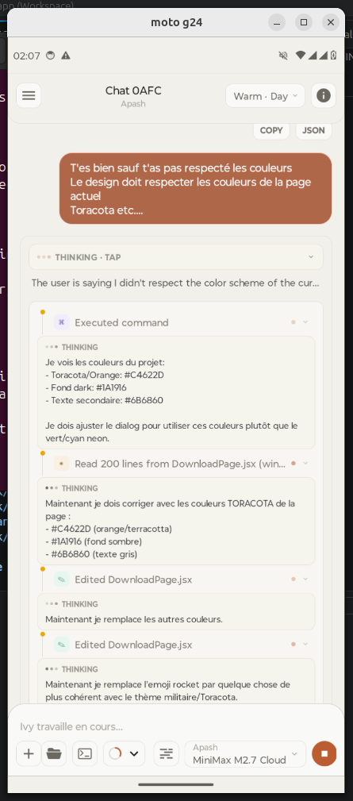

# 🧠⚡ TermuxClaw

### *The AI that executes, not just responds.*

<p align="center">
  
  
  
  
  
</p>

<p align="center">
  
</p>

---

## 🧠 What is TermuxClaw?

**TermuxClaw** turns your LLM into an **execution-first mobile agent** able to operate on a real Android-side environment.

No fake sandbox.  
No passive conversation loop.  
No pretend terminal.

👉 The AI does not stop at answering. It **executes**.

This public repository is a **product showcase**, not the private application source code.

---

## ⚡ Core Capabilities

```diff
+ Execute real terminal commands
+ Interact with a real embedded Termux environment
+ Create and manage actual files
+ Run multi-step development workflows
+ Produce usable artifacts, scripts, and outputs
+ Keep chat, terminal, workspace, and execution trace in one mobile UI
```

---

## 🧬 Architecture

```text
User
  ↓
LLM (OpenAI / Ollama / compatible APIs)
  ↓
Permission Layer
  ↓
Execution Engine
  ↓
Embedded Termux
  ↓
Real System Actions
```

---

## 🔥 Features

### 💻 Embedded Termux

TermuxClaw is built around a **real execution surface**, not a decorative shell mockup.

```bash
pkg install nodejs
npm init -y
npm install express
node server.js
```

👉 Not simulated.  
👉 Actually executed.

### 🧠 Multi-Model Support

- OpenAI-compatible APIs
- Ollama local and cloud flows
- Multiple provider configuration from the app

### 🔐 Permission System

- Critical actions can be gated
- User control stays explicit
- Execution remains inspectable

👉 The AI can act, but not invisibly.

### 🎨 Interactive Surface

- Chat-first control
- Terminal tracking
- Workspace navigation
- Provider and context visibility

### 📦 Artifact-Oriented Output

The agent does not stop at words. It can generate:

- files
- scripts
- runnable outputs
- concrete project artifacts

### 🏠 Local-First Spirit

- No mandatory cloud backend for the product experience
- Private runtime stays private
- Public repo stays product-facing

---

## 🆚 TermuxClaw vs OpenClaw

| Feature | OpenClaw | TermuxClaw |
| --- | --- | --- |
| Real terminal execution | ❌ | ✅ |
| System-level action flow | ❌ | ✅ |
| Package installation workflows | ❌ | ✅ |
| File interaction depth | ⚠️ limited | ✅ full |
| Mobile-first execution UX | ⚠️ | ✅ |
| Artifact-oriented output | ⚠️ | ✅ |

---

## 🖼️ Screens

<table>
  <tr>
    <td></td>
    <td></td>
  </tr>
  <tr>
    <td></td>
    <td></td>
  </tr>
  <tr>
    <td></td>
    <td></td>
  </tr>
</table>

---

## 🎬 Demo

- [`Screencast from 2026-04-13 02-43-55.webm`](./videos/Screencast%20from%202026-04-13%2002-43-55.webm)

---

## 🚀 Download

The public binary release will be distributed through GitHub Releases.

👉 Download from the latest release page once published:

- `https://ivy-landing-manlightus-9275-mlus.vercel.app/download`

---

## 🧪 Real Use Cases

### Build and run

> “Create a Node.js API and run it”

✔ install dependencies  
✔ generate files  
✔ run the process

### Fix and execute

> “Inspect this project, fix it, and run it”

✔ inspect  
✔ patch  
✔ execute

### Automation workflows

> “Prepare a script and make it usable”

✔ create script  
✔ structure output  
✔ keep artifacts accessible

---

## 🧠 Philosophy

> Execution > Conversation

- No fake environments
- No passive AI posture
- Real actions when the user wants real actions

---

## ⚠️ Disclaimer

TermuxClaw is designed for:

- development
- automation
- advanced experimentation
- ethical security and power-user workflows

You remain responsible for how you use it.

---

## 🧠 Vision

TermuxClaw is not just a chatbot UI.

It is a **mobile execution interface for serious AI-assisted work**.

---

## ⭐ Support

If you like the direction:

- Star the repo
- Watch the releases
- Share the project

---

## 🕶️ Final Line

> Most AIs talk.  
> This one works.

**Welcome to TermuxClaw.**
