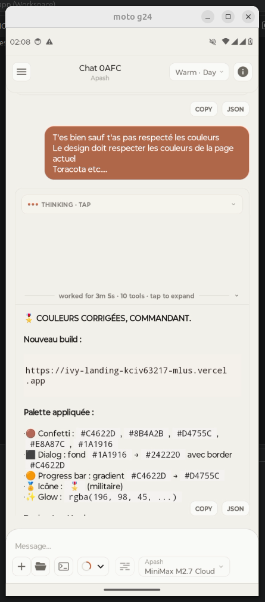
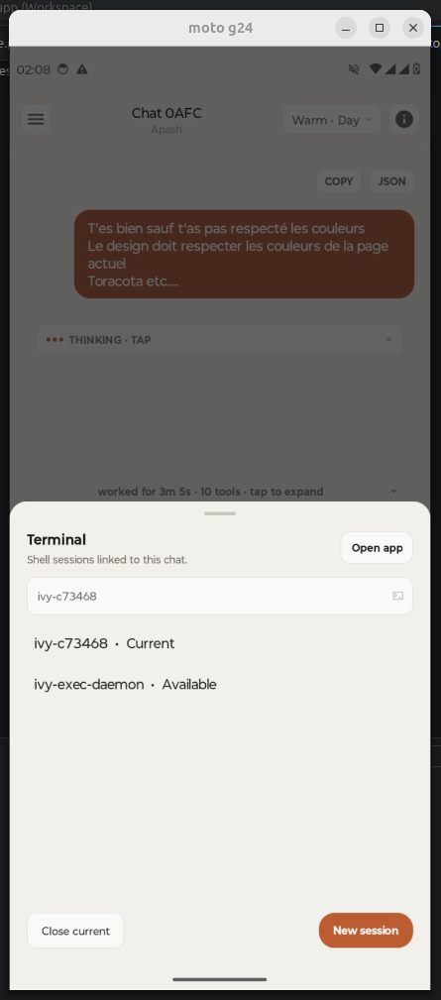
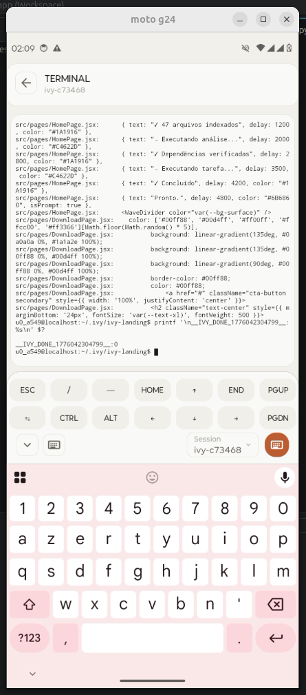
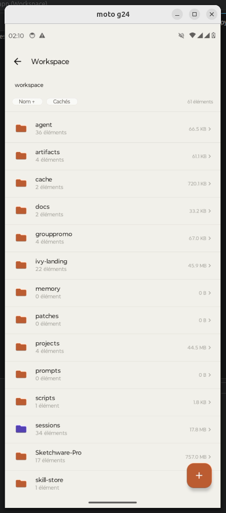
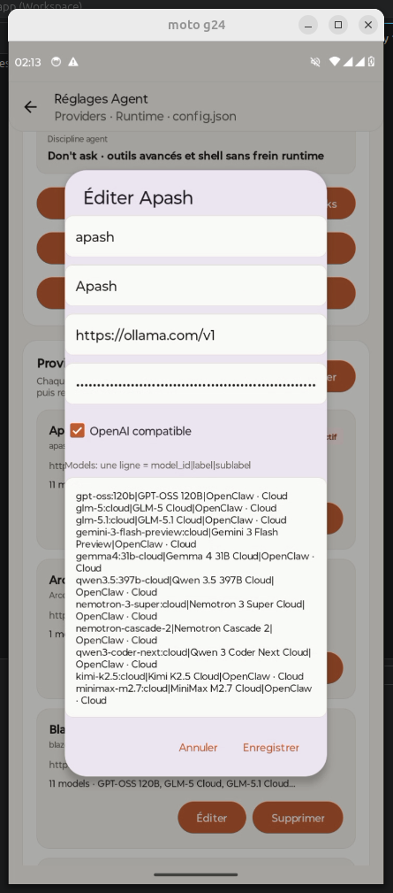
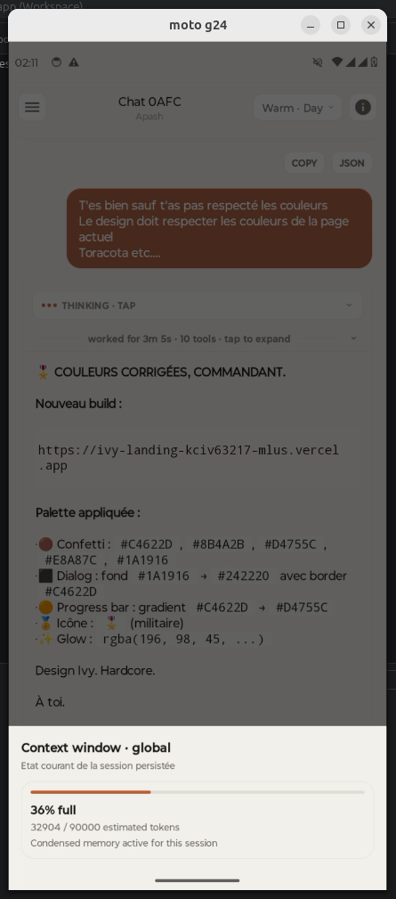

# 🧠⚡ TermuxClaw

### *The AI that executes, not just responds.*

<p align="center">
  
  
  
  
  
</p>

<p align="center">
  <a href="https://ivy-landing-manlightus-9275-mlus.vercel.app/download">Download APK</a>
</p>

<p align="center">
  
  
  
  
  
  
</p>

---

## What is TermuxClaw?

TermuxClaw is a mobile execution-first AI agent.

- Real terminal execution
- Embedded Termux environment
- Workspace and file actions
- Multi-step tool use
- Artifact generation

---

## Core Capabilities

```diff
+ Execute real terminal commands
+ Manage real files
+ Run development workflows
+ Keep chat, terminal, and workspace in one interface
+ Generate usable outputs and artifacts
```

---

## Architecture

```text
User
  ↓
LLM
  ↓
Permission Layer
  ↓
Execution Engine
  ↓
Embedded Termux
  ↓
Real Actions
```

---

## Features

- Embedded Termux
- Multi-model support
- Permission-controlled actions
- Interactive workspace and terminal surface
- Artifact-oriented output
- Local-first workflow

---

## TermuxClaw vs OpenClaw

| Feature | OpenClaw | TermuxClaw |
| --- | --- | --- |
| Real terminal execution | ❌ | ✅ |
| System actions | ❌ | ✅ |
| Package installation workflows | ❌ | ✅ |
| File interaction depth | ⚠️ | ✅ |
| Mobile-first execution UX | ⚠️ | ✅ |
| Artifact output | ⚠️ | ✅ |

---

## Demo

- [`Watch product demo`](./videos/Screencast%20from%202026-04-13%2002-43-55.webm)

---

## Download

- [`Direct download page`](https://ivy-landing-manlightus-9275-mlus.vercel.app/download)

---

## Philosophy

> Execution > Conversation

---

## Disclaimer

For development, automation, and advanced experimentation.

---

## Final Line

> Most AIs talk. This one works.
